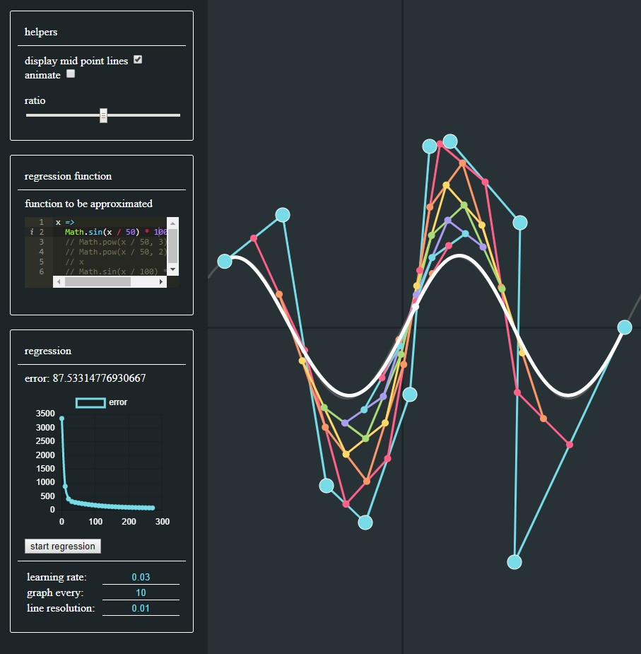
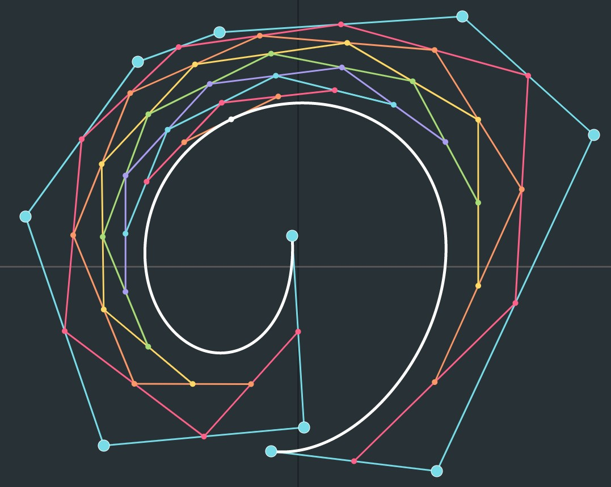

# bezier-regression
An implementation of the bezier, with added regression. With this program, you can estimate a function with a bezier curve.  
Cool screenshots:  
  

# Mathematical background
If you want to see the mathematical background, check the [docs folder](docs/math.pdf);
